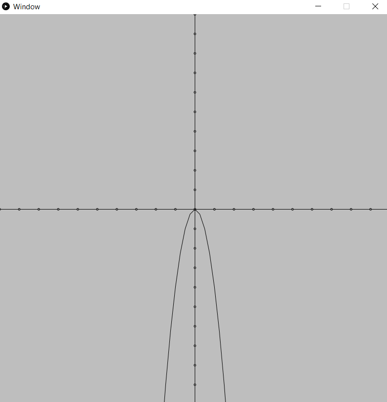

<h1>calculator</h1>

    This is a calculator that can parse a mathematical expression, turn it into a tree
    and do operations on it(simplify, calculate, etc...).
    It can also store user assigned variables. Variables can be values or a whole expression with other variables. 
    Functions are also supported. A user can assign an expression to a function, and solve for a specific x or y.
    Functions can also be plotted using a minimal processing window that shows the shape of the function. 

<h2>How to use</h2>
<table>
        <tr>
            <th>expression</th>
            <th>syntax</th>
            <th>example</th>
            <th>note</th>
        </tr>
        <tr>
            <td>logarithms</td>
            <td>log,&lt;base&gt;,(&lt;value&gt;)</td>
            <td>log,2,(8) = 3</td>
            <td>if base is emitted, it defaults to 10</td>
        </tr>
        <tr>
            <td>radicals</td>
            <td>rad,&lt;index&gt;,(&lt;radicant&gt;)</td>
            <td>rad,3,(27) = 3</td>
            <td>if index is emitted, it defaults to 2</td>
        </tr>
        <tr>
            <td>pi</td>
            <td>pi</td>
            <td>2*pi = 6.2831 </td>
            <td></td>
        </tr>
        <tr>
            <td>sine</td>
            <td>sin(&lt;value&gt;)</td>
            <td>sin(pi/2) = 1</td>
            <td></td>
        </tr>
        <tr>
            <td>cosine</td>
            <td>cos(&lt;value&gt;)</td>
            <td>cos(pi) = -1</td>
            <td></td>
        </tr>
        <tr>
            <td>tangent</td>
            <td>tan(&lt;value&gt;)</td>
            <td>tan(pi/4)</td>
            <td></td>
        </tr>
        <tr>
            <td>variables</td>
            <td>&lt;var name&gt; =</td>
            <td>x = log(2)</td>
            <td></td>
        </tr>
        <tr>
            <td>functions</td>
            <td>&lt;one letter name&gt;(&lt;var name&gt;) = expression)</td>
            <td>f(x) = log(x)</td>
            <td>for more info about functions, click <a href="#functions">here</a></td>
        </tr>
        <tr>
            <td>plotting a function</td>
            <td>plot &lt;one letter name&gt;(&lt;var name&gt;)</td>
            <td>plot f(x)</td>
            <td></td>
        </tr>

</table>
<h4 id="functions">Functions</h4>

Functions can be used to solve for some x, some y or to be plotted.  
suppose we have the function f(x) = x + 10
These operations are valid: 

<ul>
<li>f(2)</li>
<li>f(x) = 2</li>
<li>plot f(x)</li>
</ul>

These operation are <b>not</b> valid: 

<ul>
<li>f(h(x))</li>
<li>f(x) = g(x)</li>
<li>f(x) = new mapping (this would just solve for y)</li>
</ul>
<h3>example plots</h3>
<h4>-x^2</h4>

<h4>log(x) * 10</h4>

